## 1일차
- docker 빌드 설정
    - DBtest builder 생성

    ```docker
    # 베이스 이미지
    FROM ubuntu:22.04

    # 메타데이터 추가
    LABEL maintainer="kbb9554@naver.com"

    # 시스템 업데이트트
    RUN apt update -y && \
        apt install -y sudo openssh-server wget nano net-tools iputils-ping openjdk-8-jdk python3-pip && \
        apt clean && \ 
        rm -rf /var/lib/apt/lists/*

    # 계정생성 및 세팅
    RUN groupadd pkdata && useradd -m -d /home/pkdata -s /bin/bash -g pkdata -G sudo pkdata &&\
        echo "pkdata:1234" | chpasswd && \
        mkdir -p /home/pkdata/.ssh && \
        chown -R pkdata:pkdata /home/pkdata && \
        echo "export JAVA_HOME=/usr/lib/jvm/java-8-openjdk-amd64" >> /home/pkdata/.bashrc && \
        echo "export PATH=$PATH:/home/pkdata/.local/bin" >> /home/pkdata/.bashrc && \
        chown pkdata:pkdata /home/pkdata/.bashrc && \
        mkdir -p /var/run/sshd && \
        echo "PermitRootLogin no" >> /etc/ssh/sshd_config && \
        echo "PasswordAuthentication yes" >> /etc/ssh/sshd_config

    # 사용자 변경
    USER pkdata

    #작업환경 변경
    WORKDIR /home/pkdata

    # pip 업그레이드 및 주피터랩 설치
    RUN pip install --upgrade pip && pip install jupyterlab && \
        echo "export PATH=\$home/.local/bin:\$PATH" >> ~/.bashrc && \

    # CMD^[" "]형태로 해야한다. *공백 꼭 해줘야함
    # ssh 서버 실행 및 주피터랩 가동(외부접속가능)
    CMD ["/bin/bash", "-c", "service ssh start && python3 -m jupyterlab --ip=0.0.0.0 --port=8888 --allow-root --FileContentsManager.delete_to_trash=False"]

    ```
    - [Dockerfile]

    - 실행
        - 해당 파일 주소로 가서 실행 (PS D:\kgy\code\dockerfile_data\DBtest)
        
        - ```docker build -t myj:1.0 .```입력
    
- compose.yml 파일 생성

    
    ```yml
    # test compose.yml 작성
    services:
        jupyterlab1: 
            image: myj:1.0
            container_name: jupyterlab1
            hostname: JUPYTERLAB1
            command: /bin/bash -c "service ssh start && python3 -m jupyterlab --ip=0.0.0.0 --port=8888 --allow-root --FileContentsManager.delete_to_trash=False"
            ports:
                - "8888:8888"
                - "22:22"

        jupyterlab2: 
            image: myj:1.0
            container_name: jupyterlab2
            hostname: JUPYTERLAB2
            command: /bin/bash -c "service ssh start && python3 -m jupyterlab --ip=0.0.0.0 --port=8888 --allow-root --FileContentsManager.delete_to_trash=False"
            ports:
                - "8889:8888"
                - "23:22"

        jupyterlab3: 
            image: myj:1.0
            container_name: jupyterlab3
            hostname: JUPYTERLAB3
            command: /bin/bash -c "service ssh start && python3 -m jupyterlab --ip=0.0.0.0 --port=8888 --allow-root --FileContentsManager.delete_to_trash=False"
            ports:
                - "8890:8888"
                - "24:22"
    ```
- 실제로 만들 compose.yml
    ```yml
    # 실제로 만들 compose.yml
    services:
        jupyterlab: 
            build: 
            context: .
            dockerfile: Dockerfile
            container_name: jupyterlab
            hostname: JUPYTERLAB
            command: /bin/bash -c "service ssh start && python3 -m jupyterlab --ip=0.0.0.0 --port=8888 --allow-root --FileContentsManager.delete_to_trash=False"
            ports:
            - "8888:8888" # JupyterLab 기본 포트
            - "22:22" # SSH 기본 포트
            volumes:
            - D:\kgy\code:/home/pkdata/data # 호스트와 컨테이너 간의 데이터 공유
            networks:
            - db_net # db_net 네트워크 사용

        mysql:
            image: mysql:8.0
            container_name: mysql
            ports:
                - "3306:3306" # MySQL 기본 포트
            command: mysqld
            environment:
                MYSQL_ROOT_PASSWORD: "1234" # MySQL root 비밀번호
            networks:
            - db_net # db_net 네트워크 사용
            volumes:    
                - mysql_data:/var/lib/mysql # 도커 볼륨과 컨테이너 내부 저장공간 연결 설정
                - mysql_conf:/etc/mysql/mysql.conf.d

        mongodb:
            image: mongodb/mongodb-community-server:8.0.3-ubi8
            container_name: mongodb
            hostname: MONGODB
            ports:
                - "27017:27017" # MongoDB 기본 포트
            networks:
                - db_net # db_net 네트워크 사용
            volumes:
                - mongodb_data:/var/lib/mongodb # MongoDB 데이터 저장소

        oracle-db:
            image: gvenzl/oracle-xe:21-slim
            container_name: oracle
            ports:
                - "1521:1521" # Oracle DB 기본 포트
                - "5500:5500" # 웹포트 매니저
            environment:
                ORACLE_PASSWORD: oracle # Oracle DB 비밀번호
                APP_USER: pknu # Oracle DB 사용자
                APP_USER_PASSWORD: 1234 # Oracle DB 사용자 비밀번호
            networks:
                - db_net # 내부와 통신이 가능하도록 db_net 이름의 네트워크 설정 
            volumes:
                - oracle_data:/opt/oracle/oradata # Oracle DB 데이터 저장소


    networks:
        db_net: 
            driver: bridge # 브릿지 네트워크 사용

    volumes:
        mysql_data: # MySQL 데이터 저장소
        mysql_conf: # MySQL 설정 파일 저장소
        mongodb_data: # MongoDB 데이터 저장소
        oracle_data: # Oracle DB 데이터 저장소
    

    ```
    [docker-compose.yml](./DBtest/docker-compose.yml)


    - 실행
        - 통합 터미널에서 열기 클릭
        - PS D:\kgy\code\dockerfile_data\DBtest> ```docker compose up  -d```
        - 로그인 에러가 뜰경우
        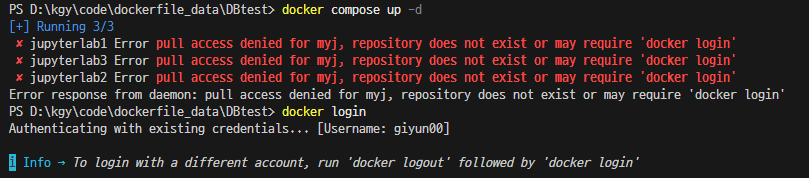
        - PS D:\kgy\code\dockerfile_data\DBtest> ```docker login``` 을 입력
        - 그 후 다시 ```docker compose up -d ``` 입력
        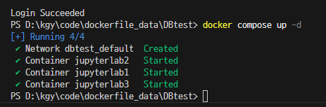
        - volumes (외부적으로 저장)
    
    ```md
    # 주피터에서 확인해본것
    !ifconfig # 내 ip 찾기
    !ping Mongodb # 내 몽고db 핑 확인
    ctrl + i # 한 단어 선택(유틸)
    본인 주소 : 127.0.0.1 = localhost
    ```

- mysql 
    - https://dev.mysql.com/downloads/workbench/ 에서 download  클릭 후 
        `No thanks, just start my download.` 클릭
    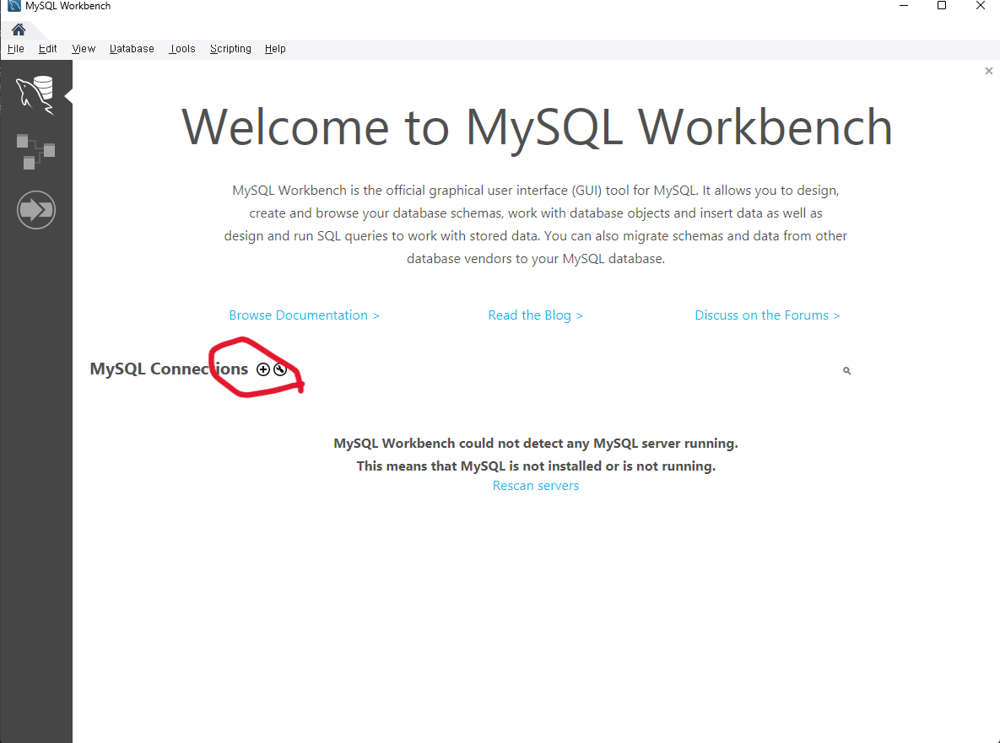
    - 빨간색 동그라미 + 클릭릭
    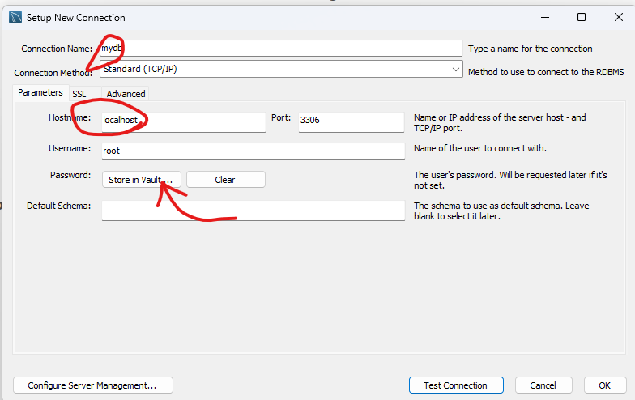
    - 커넥션 이름과 호스트 네임 입력
    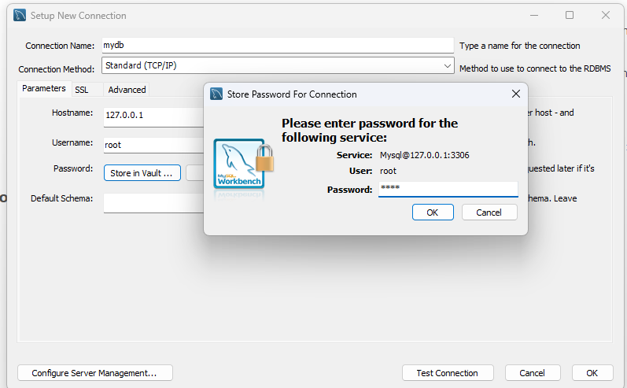
    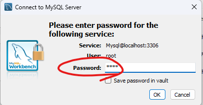
    - 비밀번호 입력 후 connetion 을 누르면면
    
    - 위와 같이 창이뜨면 넘어감
    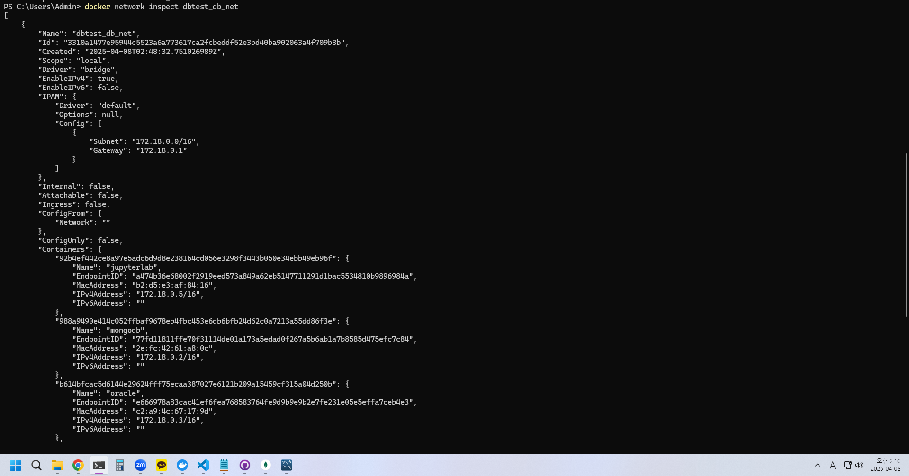
    - docker network inspect dbtest_db_net 을 누르면 저렇게 내부망 외부망 정보가 뜬다.
    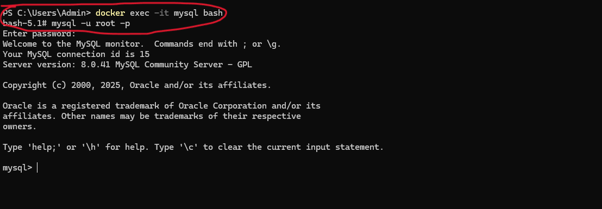
    - bash 와 mysql 까지 들어간 모습
    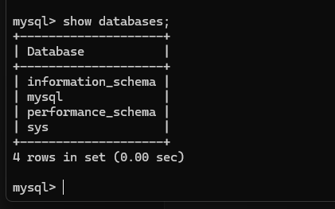
    - 스키마 확인
    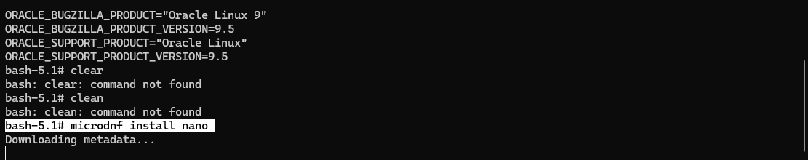
    - nano 설치 용도 
    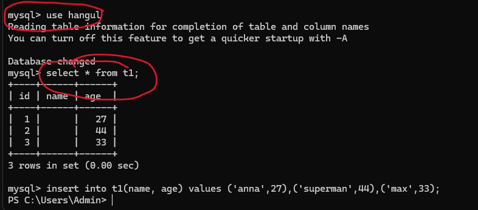
    - 사용할 스키마와 테이블을 을 읽어본 모습


## 2일차

