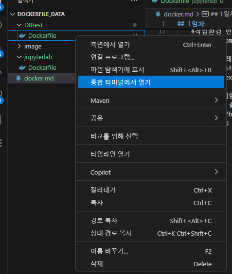
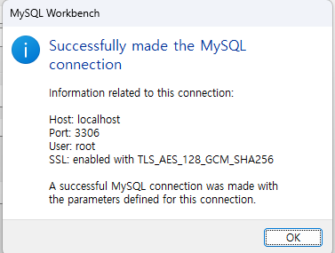

## 1일차
- docker 빌드 설정
    - DBtest builder 생성

    ```docker
    # 베이스 이미지
    FROM ubuntu:22.04

    # 메타데이터 추가
    LABEL maintainer="kbb9554@naver.com"

    # 시스템 업데이트트
    RUN apt update -y && \
        apt install -y sudo openssh-server wget nano net-tools iputils-ping openjdk-8-jdk python3-pip && \
        apt clean && \ 
        rm -rf /var/lib/apt/lists/*

    # 계정생성 및 세팅
    RUN groupadd pkdata && useradd -m -d /home/pkdata -s /bin/bash -g pkdata -G sudo pkdata &&\
        echo "pkdata:1234" | chpasswd && \
        mkdir -p /home/pkdata/.ssh && \
        chown -R pkdata:pkdata /home/pkdata && \
        echo "export JAVA_HOME=/usr/lib/jvm/java-8-openjdk-amd64" >> /home/pkdata/.bashrc && \
        echo "export PATH=$PATH:/home/pkdata/.local/bin" >> /home/pkdata/.bashrc && \
        chown pkdata:pkdata /home/pkdata/.bashrc && \
        mkdir -p /var/run/sshd && \
        echo "PermitRootLogin no" >> /etc/ssh/sshd_config && \
        echo "PasswordAuthentication yes" >> /etc/ssh/sshd_config

    # 사용자 변경
    USER pkdata

    #작업환경 변경
    WORKDIR /home/pkdata

    # pip 업그레이드 및 주피터랩 설치
    RUN pip install --upgrade pip && pip install jupyterlab && \
        echo "export PATH=\$home/.local/bin:\$PATH" >> ~/.bashrc && \

    # CMD^[" "]형태로 해야한다. *공백 꼭 해줘야함
    # ssh 서버 실행 및 주피터랩 가동(외부접속가능)
    CMD ["/bin/bash", "-c", "service ssh start && python3 -m jupyterlab --ip=0.0.0.0 --port=8888 --allow-root --FileContentsManager.delete_to_trash=False"]

    ```
    - [Dockerfile](./DBtest/Dockerfile)

    - 실행
        - 해당 파일 주소로 가서 실행 (PS D:\kgy\code\dockerfile_data\DBtest)
        
        - ```docker build -t myj:1.0 .```입력
    
- compose.yml 파일 생성

    
    ```yml
    # test compose.yml 작성
    services:
        jupyterlab1: 
            image: myj:1.0
            container_name: jupyterlab1
            hostname: JUPYTERLAB1
            command: /bin/bash -c "service ssh start && python3 -m jupyterlab --ip=0.0.0.0 --port=8888 --allow-root --FileContentsManager.delete_to_trash=False"
            ports:
                - "8888:8888"
                - "22:22"

        jupyterlab2: 
            image: myj:1.0
            container_name: jupyterlab2
            hostname: JUPYTERLAB2
            command: /bin/bash -c "service ssh start && python3 -m jupyterlab --ip=0.0.0.0 --port=8888 --allow-root --FileContentsManager.delete_to_trash=False"
            ports:
                - "8889:8888"
                - "23:22"

        jupyterlab3: 
            image: myj:1.0
            container_name: jupyterlab3
            hostname: JUPYTERLAB3
            command: /bin/bash -c "service ssh start && python3 -m jupyterlab --ip=0.0.0.0 --port=8888 --allow-root --FileContentsManager.delete_to_trash=False"
            ports:
                - "8890:8888"
                - "24:22"
    ```
- 실제로 만들 compose.yml
    ```yml
    # 실제로 만들 compose.yml
    services:
        jupyterlab: 
            build: 
            context: .
            dockerfile: Dockerfile
            container_name: jupyterlab
            hostname: JUPYTERLAB
            command: /bin/bash -c "service ssh start && python3 -m jupyterlab --ip=0.0.0.0 --port=8888 --allow-root --FileContentsManager.delete_to_trash=False"
            ports:
            - "8888:8888" # JupyterLab 기본 포트
            - "22:22" # SSH 기본 포트
            volumes:
            - D:\kgy\code:/home/pkdata/data # 호스트와 컨테이너 간의 데이터 공유
            networks:
            - db_net # db_net 네트워크 사용

        mysql:
            image: mysql:8.0
            container_name: mysql
            ports:
                - "3306:3306" # MySQL 기본 포트
            command: mysqld
            environment:
                MYSQL_ROOT_PASSWORD: "1234" # MySQL root 비밀번호
            networks:
            - db_net # db_net 네트워크 사용
            volumes:    
                - mysql_data:/var/lib/mysql # 도커 볼륨과 컨테이너 내부 저장공간 연결 설정
                - mysql_conf:/etc/mysql/mysql.conf.d

        mongodb:
            image: mongodb/mongodb-community-server:8.0.3-ubi8
            container_name: mongodb
            hostname: MONGODB
            ports:
                - "27017:27017" # MongoDB 기본 포트
            networks:
                - db_net # db_net 네트워크 사용
            volumes:
                - mongodb_data:/var/lib/mongodb # MongoDB 데이터 저장소

        oracle-db:
            image: gvenzl/oracle-xe:21-slim
            container_name: oracle
            ports:
                - "1521:1521" # Oracle DB 기본 포트
                - "5500:5500" # 웹포트 매니저
            environment:
                ORACLE_PASSWORD: oracle # Oracle DB 비밀번호
                APP_USER: pknu # Oracle DB 사용자
                APP_USER_PASSWORD: 1234 # Oracle DB 사용자 비밀번호
            networks:
                - db_net # 내부와 통신이 가능하도록 db_net 이름의 네트워크 설정 
            volumes:
                - oracle_data:/opt/oracle/oradata # Oracle DB 데이터 저장소


    networks:
        db_net: 
            driver: bridge # 브릿지 네트워크 사용

    volumes:
        mysql_data: # MySQL 데이터 저장소
        mysql_conf: # MySQL 설정 파일 저장소
        mongodb_data: # MongoDB 데이터 저장소
        oracle_data: # Oracle DB 데이터 저장소
    

    ```
    [docker-compose.yml](./DBtest/docker-compose.yml)


    - 실행
        - 통합 터미널에서 열기 클릭
        - PS D:\kgy\code\dockerfile_data\DBtest> ```docker compose up  -d```
        - 로그인 에러가 뜰경우
        
        - PS D:\kgy\code\dockerfile_data\DBtest> ```docker login``` 을 입력
        - 그 후 다시 ```docker compose up -d ``` 입력
        
        - volumes (외부적으로 저장)
    
    ```md
    # 주피터에서 확인해본것
    !ifconfig # 내 ip 찾기
    !ping Mongodb # 내 몽고db 핑 확인
    ctrl + i # 한 단어 선택(유틸)
    본인 주소 : 127.0.0.1 = localhost
    ```

- mysql 
    - https://dev.mysql.com/downloads/workbench/ 에서 download  클릭 후 
        `No thanks, just start my download.` 클릭
    
    - 빨간색 동그라미 + 클릭릭
    
    - 커넥션 이름과 호스트 네임 입력
    
    
    - 비밀번호 입력 후 connetion 을 누르면면
    
    - 위와 같이 창이뜨면 넘어감
    
    - docker network inspect dbtest_db_net 을 누르면 저렇게 내부망 외부망 정보가 뜬다.
    
    - bash 와 mysql 까지 들어간 모습
    
    - 스키마 확인
    
    - nano 설치 용도 
    
    - 사용할 스키마와 테이블을 을 읽어본 모습


## 2일차
- mysql 테스트 데이터
    - https://dev.mysql.com/doc/ 에 접속 more 클릭
    - Example Databases 에서 world  database 다운

    

### mongodb
- 특징 :
    - `문서 지향 저장(Document-Oriented Storage)`: JSON과 유사한 BSON 포맷의 문서 형태로 데이터를 저장하여 복잡한 계층 구조의 데이터를 효율적으로 관리.
    <br>
    - `스키마 유연성(Schema Flexibility)`: 스키마리스 구조를 지원하여 다양한 형태의 데이터를 동일한 컬렉션에 저장할 수 있으며, 데이터 모델의 변경이 용이.
    <br>
    - `수평적 확장성(Horizontal Scalability)`: 샤딩(shardiing)을 통해 데이터를 여러 서버에 분산 저장하여 대규모 데이터 처리와 부하 분산에 효과적.
    <br>
    - `고가용성(High Availability)`: 레플리카 세트(replica set)를 지원하여 데이터 복제를 통해 장애 발생 시 자동으로 대체 서버로 전환되어 서비스의 지속성을 보장함.
    <br>
    - `다양한 인덱스 지원(Index Support)`: 다양한 형태의 인덱스를 지원하여 빠른 데이터 검색이 가능합니다.
    <br>
    - `JavaScript지원`: 서버 측에서 JavaScript를 사용하여 복잡한 쿼리나 집계 작업을 수행.
    <br>
    - 위의 특징들로 인해 MongoDB는 대용량의 비정형 데이터 처리하는 웹 애플리케이션에서 널리 사용.
    <br>
    - mongodb 6.0이상으로 5.x 대를 빨리 건너뜀
        6.0 이상은 실행 쉘이 없기에 mongosh 를 설치해서 작동해야함
    <br>
- 정형데이터, 반정형데이터, 비정형데이터의 차이점
    1. `정형데이터(Structured Data)`: 미리 정의된 형식과 구조를 가진 데이터로, 행과 열로 구성된 테이블 형태로 저장됨. 예를 들어, 데이터베이스의 고객 정보나 판매 기록 등이 이에 해당. 이러한 데이터는 SQL과 같은 언어를 사용하여 쉽게 검색, 갱신, 삭제 등의 연산을 수행할 수 있음.
    <br>
    2. `반정형데이터(Semi-Structured Data)`: 정형데이터와 비정형데이터의 중간 형태로, 일정한 구조를 가지지만 완전히 고정되지 않은 데이터를 의미. 예를 들어, XML, JSON, HTML과 같은 포맷이 이에 해당, 이러한 데이터는 스키마가 존재하지만 유연하게 변경될 수 있음. (mongodb)
    <br>
    3. `비정형데이터(Unstructured Data)`: 정해진 구조가 없는 데이터로, 텍스트 문서, 이미지, 동영상, 오디오 파일 등이 이에 해당. 이러한 데이터는 내부 구조가 없거나 일정하지 않아 기존의 데이터 베이스 도구로 관리하거나 분석하기 어려움.

- SQL과 NoSQL의 차이점
    - `데이터모델` :
        - SQL 데이터베이스: 고정된 스키마를 따르는 관계형 데이터베이스로, 테이블 간의 관계를 기반으로 데이터를 저장함.
        - NoSQL 데이터베이스: 유연한 스키마를 가지며, 문서, 키-값,열 가족, 그래프 등 다양한 형태로 데이터를 저장.
        <br>
    - `확장성`:
        - SQL 데이터베이스: 주로 수직적 확장(서버의 성능 향상)을 통해 확장.
        - NoSQL 데이터베이스: 수평적 확장(서버 수를 늘리는 방식)에 적합하여 대규모 데이터 처리에 유리.
        <br>
    - `스키마 유연성`:
        - SQL 데이터베이스 : 엄격한 스키마를 요구, 스키마 변경이 어려움.
        - NoSQL 데이터베이스: 스키마리스(schema-less)특성을 가지며, 데이터 구조의 변경이 용이.
        <br>
    - `트랙잭션 지원`:
        - SQL 데이터베이스: ACID(원자성,, 일관성, 격리성, 지속성) 특성을 완벽하게 지원함.
        - NoSQL 데이터베이스: 일부는 ACID를 지원하지만, 일반적으로 일관성보다 가용성과 파티션 내구성을 우선시하는 경향이 있음.
    

- mongodb 실행
    - 터미널에서 PS C:\Users\Admin> ```docker exec -it mongodb bash``` >> ```mongosh```입력
    - 실행해본 명령어 정리
    ```bash
    # 명령어
    ctrl + i # mongosh 에서 눌럿을 경우 help 기능처럼 들어갈 수 있는 문구를 알려준다.
    show dbs # 스키마 보기
    use mdb # db선택
    show collections # ??? 
    db.c1.find() # select * from c1 과 동일하다고 보면 됨.
    db.c1.insertOne({name:'hong',age:22,etc:"아버지부르지못함"}) # insert 하나추가
    db.c1.insertMany([{name:'coolboy',age:17 ,etc:"잘생김"}, {name:'cutegirl',age:20}]) # insert 여러개 추가
    db.c1.find({age:{$gte:20}}) # 조건문 조회 (나이가 20세이상인 사람찾기)
    db.c1.findOne({name:'hong'}) # 이름이 'hong' 인 사람 한명 찾기
    db.c1.updateOne({name:'cutegirl'},{$set:{gender:'female'}}) # 'cutegirl'인 사람의 gender 을 `female`로 수정(없으면 추가)
    db.c1.updateMany({age:{$lte:19}}, {$set:{prop:'미성년자'}})
    db.c1.deleteOne({name:'hong'}) # 이름이 'hong'인 사람 하나 제거
    db.c1.deleteMany({name:/^test/}) # 이름이 test가 들어간 사람들 다수 제거
    


    ### 비교구문 6가지 ###
    [GT] > :크다
    [GTE]/[GE] >= : 크거나 작다
    [LT] < : 작다
    [LTE]/[LE] <= : 작거나 같다
    [EQ] ==, === : 같다
    [NEQ]/[NE] <>, !, NOT : 다르다 
    ```


    


